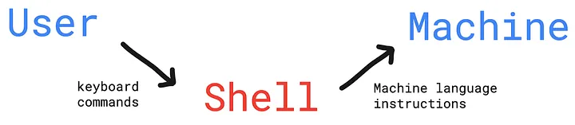
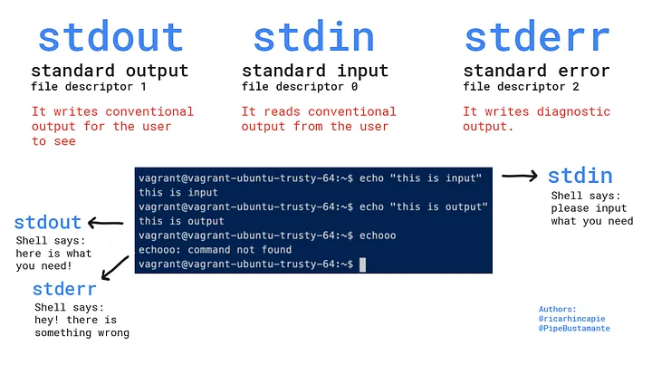
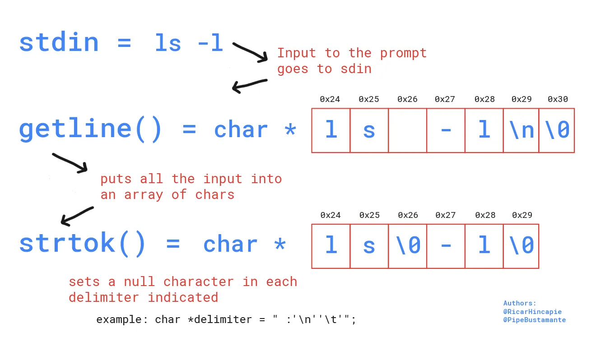
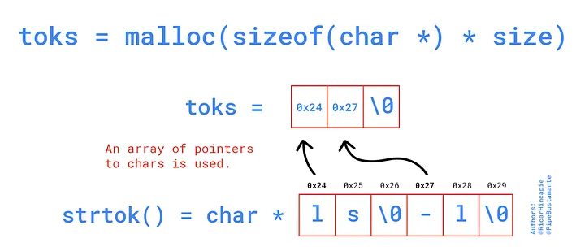
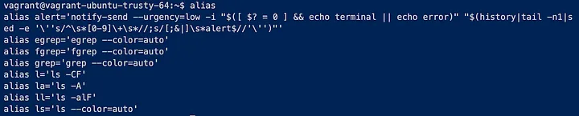
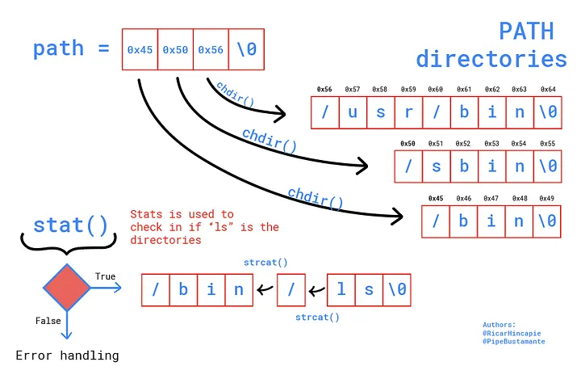

# C-shell
a Shell written in C programming language

# Theory
Shell is a program that takes the command inputs written from the the user’s keyboard and passes them to the machine to execute them through the kernel. It also verifies if the command inputs from the user are correct.


You need to have in mind here the stdio.h library. It is a library that contains the functions to the input and output processes of the system. For example, it has functions to read commands from the user and to write in screen the results of his requests. At system startup, three streams of data are opened: stdio, stdout and stderr.



So, int ac_attribute_((unused)) we will tell us how many arguments are we receiving, and the attribute is telling the compiler to don’t show warnings if the variable is not being used. The char **avis receiving a string.

In case of the ls -l command, the function would be reciving the following: int ac = 2 , because it takes the spaces as dividers; and chars[5] = “ls -l".

The while loop goes as follows:
```

while (int_mode)
{
int_mode = isatty(STDIN_FILENO);
   if (int_mode == 1)
   {
     write(STDOUT_FILENO, “~$ “, 13);
   }
  /* The code continues below */
}
```

The function isatty returns 1 if the file in the argument refers to a terminal, so as long as STDIN_FILENO is there, isatty will return 1. STDIN_FILENO refers to the file descriptor of the standard input –which is generally 0– and differs from using stdin because the latter refers to the file itself, not its descriptor.

At this point we make the first system call with write function. A system call is when you run a program that enters the kernel to perform a task, and they are not regularly used directly by users, but rather through wrapper functions, which contains the system call and does some work before and after it, for example, setting the error number so stderr file could store and show whatever went wrong in the execution. As you can see, the second argument in write function contains the prompt -“~$ ”- to be printed in the user’s terminal.

Once your prompt is running, the next step is to use the getline() and strtok() functions. They will take the string the user inputs in the stdin, store it into an array of characters and parse it according to a delimiter you decide –for example, “ ”, “-”, or whatever you need–.



Now it is time to store pointers to each one of the tokens. The recommendation is to use strtok() with a while in the following way:
```
token = strtok(buffer, delimiter);
while (token != NULL)
{
   toks[counter] = strdup(token);
   token = strtok(NULL, delimiter);
   Counter++;
}
toks[counter] = token;
```
It is really important for you to remember that toks needs to be malloc, as it will need memory reserved to store char pointers to each one of the tokens.




we use the execve() function, that replaces the current program being run with a new program, even making it run on brand new stack and heap. The char **toks is passed as argument to execve(), using its first position toks[0]as the first argument, the remaining toksas the second argument and the third argument, which would receive an array of pointers to strings from the environment, for now will be set as NULL.

As we are executing a new process inside our function, it comes at hand using the fork() and wait() functions and the _pid data type. Fork creates a child process with pid == 0, and ppid == parent_pid. So, if(!pid)statement would allow us to give instructions to the child process, where execve() is working.


```
if(!pid)
{
   if (execve(args[0], args, NULL) == -1)
   {
      handle_errors();
   }
else
{
   wait();
}

```

This implementation is critical so your prompt keeps on showing after successful or error in execution.

After a few adjustments, this is what you will be able to do:


### Searching phase: working with aliases, builtins and environment

This phase needs to be done before we send anything to execve() function, and it is about comparing our toks[0]to some data structures and, if not matching, searching around the environment PATH directories to find a match for it.

The order of comparing the first argument is against: 1) aliases, 2) builtins, and 3) environment path.

#### Aliases structure
Aliases are shortcuts to regular commands that make a user’s life easier. In the case of bash, LS command has a defined alias. Go ahead and type the command alias in your terminal. We get this in ours:



Well, some clever bash contributor got the approval that by default the lscommand is an alias for ‘ls — color=auto’, which makes the directories, executable files and other special files to have a different layout so the user can identify them easier.

The alias implementation can be achieved using data structures:

```
typedef struct aliases {
char *alias_name;
char *real_name;
} alias;
```
The char *alias_name will be compared with the user’s command and, if match, the char *real_name will be returned. So, what we do is to replace the alias for the real command behind it, and take it to the parsing process.

So, following our bash, this is how the struct for part of its aliases would look like:

```
alias my_aliases[] = {
{“ls”, “ls — color=auto”},
{“ll”, “ls -alF”},
{“la”, “ls -A”},
{NULL, NULL},
} my_aliases;
```

Then, that structure is compared against ARGS[0] and replaced if matches:

```
while (my_aliases[counter].alias_name != NULL)
   {
   if (strcmp(args[0], my_aliases[counter].alias_name) == 0)
   {
      return(my_aliases[counter].real_name);
   }
   counter++;
   }

```

#### Builtins structure
The builtins are functions included in the shell itself and don’t need any other program to run them. It is to notice that builtins vary from shell to shell.

This structure is a little bit different from the aliases’ because the second member is now a pointer to function, to the builtin function!

```
typedef struct my_builtins
{
char *name;
int (*func)(void);
} my_builtins;
```
The comparing process is the same as in aliases and if there is a match, the pointer is returned and then executed.

#### Environment search for PATH
The environment is a series of variables defined by default at startup. In bash, if you input ENV, you will get in stdout a list of all those variables.

On order to access the environment, an external variable must be declared in the header :
```

extern char **environ;
```

Each one of the environment variables has a pointer aiming at it in the environ, so environ[0] points to the first variable, which in the above example is XDG_SESSION_ID=3; environ[1] points to TERM_PROGRAM =vscode, and so forth.

The PATH must be looked for and its directories saved as char * in an array of pointers, just as we did with strtok() (see figure 8.). Once we have this, the functions getcwd(), chdir() and stat() come to save the day.



Using loops, each directory is opened and stat() checks if the lscommand is there. If positive, the directory is concatenated with a slash character and also with the user’s command, and the pointer is returned to be executed as we already learned. If negative, the user’s command is not available in the PATH directories and an error message in stderr should be displayed.

This is the final product, after doing error handling with perror() and counting the promp’t loop for printing:

for code suggestion, look: https://github.com/brenns10/lsh/blob/407938170e8b40d231781576e05282a41634848c/src/main.c

